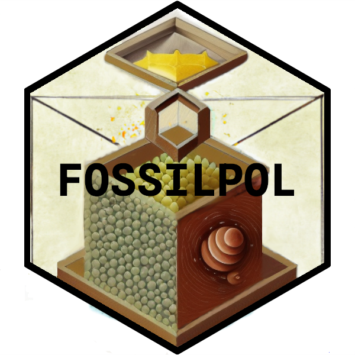
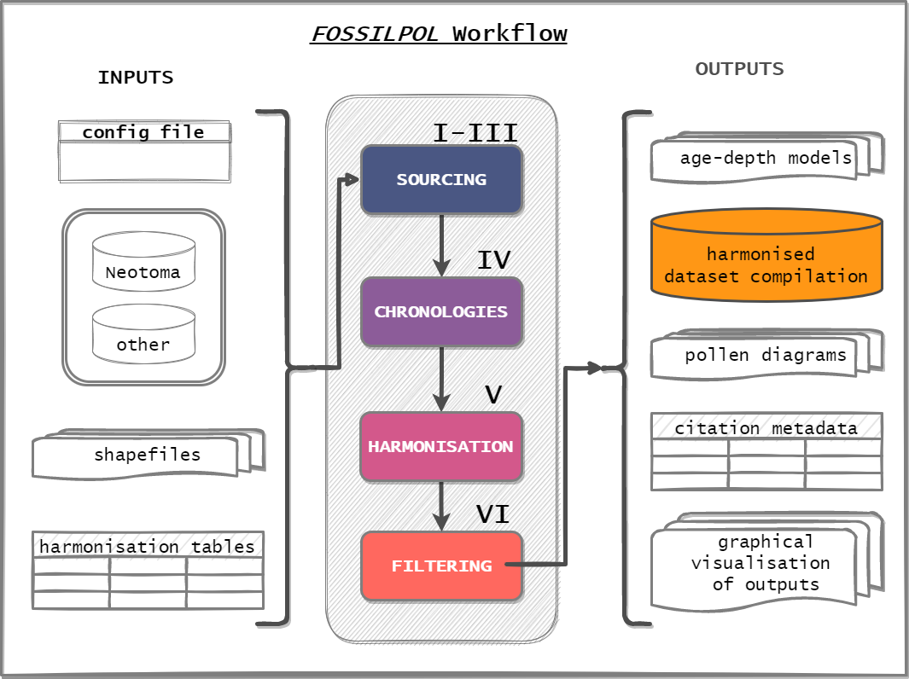

# FOSSILPOL project

- [FOSSILPOL project](#fossilpol-project)
  - [General information](#general-information)
    - [Figure 1](#figure-1)
  - [How to obtain the workflow](#how-to-obtain-the-workflow)
    - [Code block 1](#code-block-1)
    - [Set up](#set-up)
    - [Cascade of R scripts](#cascade-of-r-scripts)
      - [Code block 2](#code-block-2)

## General information

Here we present the guide on how to obtain and set up the FOSSILPOL workflow which is an [R](https://en.wikipedia.org/wiki/R_(programming_language))-based modular workflow to process multiple fossil pollen records to create a comprehensive, standardised dataset compilation, ready for multi-record and multi-proxy analyses at macroecological scales ([Fig. 1](#figure-1figure-1)). The general guide is described in the manuscript titled *A guide to the processing and standardisation of global palaeoecological data for large-scale syntheses using fossil pollen*, currently in review in [Global Ecology and Biogeography](https://onlinelibrary.wiley.com/journal/14668238).

The FOSSILPOL workflow is coded as an [RStudio project](https://support.posit.co/hc/en-us/articles/200526207-Using-RStudio-Projects) (in the [R programming language](https://en.wikipedia.org/wiki/R_(programming_language))), which should be customised by the user for their specific research project.

The FOSSILPOL workflow has been developed during the ERC project called the [*Humans on Planet Earth* (HOPE)](https://www.uib.no/en/rg/EECRG/107501/hope) team at the [University of Bergen](https://www.uib.no/en).

### Figure 1

## How to obtain the workflow

The FOSSILPOL workflow (referred to as "the Workflow" from here on) is accessible in two ways:
  
  1. If a user has a [GitHub account](https://github.com/), the easiest way is to create your own GitHub repo using this [GitHub template](https://github.com/HOPE-UIB-BIO/FOSSILPOL-workflow). More details about how to use GitHub templates are on [GitHub Docs](https://docs.github.com/en/repositories/creating-and-managing-repositories/creating-a-repository-from-a-template).
  
  2. A user can download the latest *Release* of the Workflow as a zip file from the [FOSSILPOL Workflow Release page](https://github.com/HOPE-UIB-BIO/FOSSILPOL-workflow/releases).

The R project consists of codes with individual scripts and functions. All scripts are stored in the `R/` folder. After obtaining the workflow, the FOSSILPOL R project will have the following structure:

### Code block 1

```{r}
project
│
│   README.md
│   Rprofile
│   gitignore  
│   Workflow_template.Rproj
│
└───Data
│   │
│   └───Input
│       │
│       └───Spatial
│           │
│           └───Biomes_shapefile   
│           │   │
│           │   └───WWF
│           │
│           └───Calibration_curves_shapefile   
│           │
│           └───Countries_shapefile
│           │  
│           └───Harmonisation_regions_shapefile
│           │
│           └───Postbomb_shapefile
│           │
│           └───Regions_shapefile
│
└───R
│   │
│   │   ___Init_project___.R
│   │   00_Config_file.R
│   │
│   └───01_Data_processing
│   │   │   │
│   │   │   │   Master_run_01.R
│   │   │
│   │   └───01_Neotoma_source
│   │   │   │
│   │   │   │   Run_01_01.R
│   │   │   │   01_Download_neotoma.R
│   │   │   │   02_Extract_samples.R
│   │   │   │   03_Filter_dep_env.R
│   │   │   │   04_Extract_chron_control_tables.R
│   │   │   │   05_Extract_raw_pollen_data.R
│   │   │   
│   │   └───02_Other_source
│   │   │   │
│   │   │   │   Run_01_02.R
│   │   │   │   01_Import_other_data.R
│   │   │
│   │   └───03_Merging_and_geography
│   │   │   │
│   │   │   │   Run_01_03.R
│   │   │   │   01_Merge_datasets.R
│   │   │
│   │   └───04_Chronologies
│   │   │   │
│   │   │   │   Run_01_04.R
│   │   │   │   01_Prepare_chron_control_tables.R
│   │   │   │   02_Run_age_depth_models.R
│   │   │   │   03_Predict_ages.R
│   │   │   │   04_Save_AD_figures.R
│   │   │   │   05_Merge_chron_output.R
│   │   │
│   │   └───05_Harmonisation
│   │   │   │
│   │   │   │   Run_01_05.R
│   │   │   │   01_Harmonisation.R
│   │   │
│   │   └───06_Main_filtering
│   │   │   │
│   │   │   │   Run_01_06.R
│   │   │   │   01_Level_filtering.R
│   │   │
│   │   └───07_Outputs
│   │       │
│   │       │   Run_01_07.R
│   │       │   01_Pollen_diagrams.R
│   │       │   02_Save_assembly.R
│   │       │   03_Save_references.R
│   │
│   └───02_Main_analyses
│   │   │
│   │   │   Master_run_02.R
│   │
│   └───03_Supplementary_analyses
│   │   │
│   │   │   Master_run_03.R
│   │
│   └───Functions
│       │
│       │ example_function.R
│
└───renv
    │
    │   gitignore
    │   activate.R
    │   library_list.lock
    │   settings.dcf
```

### Set up

Once a user obtains their version of the Workflow, there are several steps to be done before using it:

- Update [R](https://en.wikipedia.org/wiki/R_(programming_language)) and [R-studio IDE](https://posit.co/products/open-source/rstudio/). There are many guides on how to do so (e.g. [here](https://jennhuck.github.io/workshops/install_update_R.html))

- Execute all individual steps with the `___Init_project___.R` script. This will result in the preparation of all R-packages using the [`{renv}` package](https://rstudio.github.io/renv/articles/renv.html), which is an R dependency management of your projects. Mainly it will install two main R-packages [`{RFossilpol}`](https://github.com/HOPE-UIB-BIO/R-Fossilpol-package) and [`{RUtilpol}`](https://github.com/HOPE-UIB-BIO/R-Utilpol-package) and all their dependencies. {RFossilpol} has been developed specifically for the workflow and the latest release is automatically installed in the project set-up stage. This is important as the package version should align with the Workflow version. Therefore, we do not recommend updating the package after installation. Note that installing all packages can take a substantial amount of time.

- Set up your preferences by editing the `00_Config_file.R` script (referred to as "*Config file*" from here on). The Config file is a script where all settings and criteria used throughout the project are predefined by the user before running the Workflow. In addition, it prepares the current session by loading the required packages and saving all settings throughout the project. Points in the Config file that require the user's attention are flagged by "**[USER]**", meaning that these are criteria that need to be checked by the user. More info on the Config file is given in the website section [A step-by-step guide](step_by_step_guide.html). The crucial points are:

  - `data_storage_path` within section "*2. Current date and working directory*" - as the Workflow produces several large files, a user can specify the directory where such files will be placed. Note that the default place is within the project.

  - section "*5. Define variables*" - there are many variables important for data selection and filtering of the final data assembly.

- Run `R/01_Data_processing/Master_run_01.R` to run the whole data processing part of the project (be ready for [**"stop-checks"**](step_by_step_guide.html#data-stor)). Alternatively, the user can run each script individually. After all *stop-checks* are resolved, the Workflow can be run as a whole to produce the standardised dataset compilation, ready for multi-record and multi-proxy analyses.

- If desired, the user can run additional project-specific scripts (not provided) in the `02_Main_analyses` and `03_Supplementary_analyses` folders to analyse the data compilation.

### Cascade of R scripts

This Workflow is constructed using a *script cascade*. This means that the `Master_run_01.R`, located within `R/01_Data_processing/` folder, executes all scripts within sub-folders of the `R/01_Data_processing/`  folder, which in turn, executes all their sub-folders (e.g., `R/01_Data_processing/01_Neotoma_source/Run_01_01.R` executes `R/01_Data_processing/01_Neotoma_source/01_Download_neotoma.R`, `R/01_Data_processing/01_Neotoma_source /02_Extract_samples.R`, ...). See [Code block 2](#code-block-2).

Therefore, a user can run the data processing section of the project by executing `R/01_Data_processing/Master_run_01.R` script or run individual sections by executing individual scripts within sections. An alternative example is that the user can run the Workflow subsection as a whole by running `R/01_Data_processing/01_Neotoma_source/Run_01_01.R`, and not `R/01_Data_processing/01_Neotoma_source/01_Download_neotoma.R`,  and then `R/01_Data_processing/01_Neotoma_source /02_Extract_samples.R`, etc.

#### Code block 2

```{r}
R
│
└───01_Data_processing
        │
        │   Master_run_01.R
        │
        └───01_Neotoma_source
            │
            │   Run_01_01.R
                │
                │   01_Download_neotoma.R
                │   02_Extract_samples.R
                │   03_Filter_dep_env.R
                │   04_Extract_chron_control_tables.R
                │   05_Extract_raw_pollen_data.R

```
