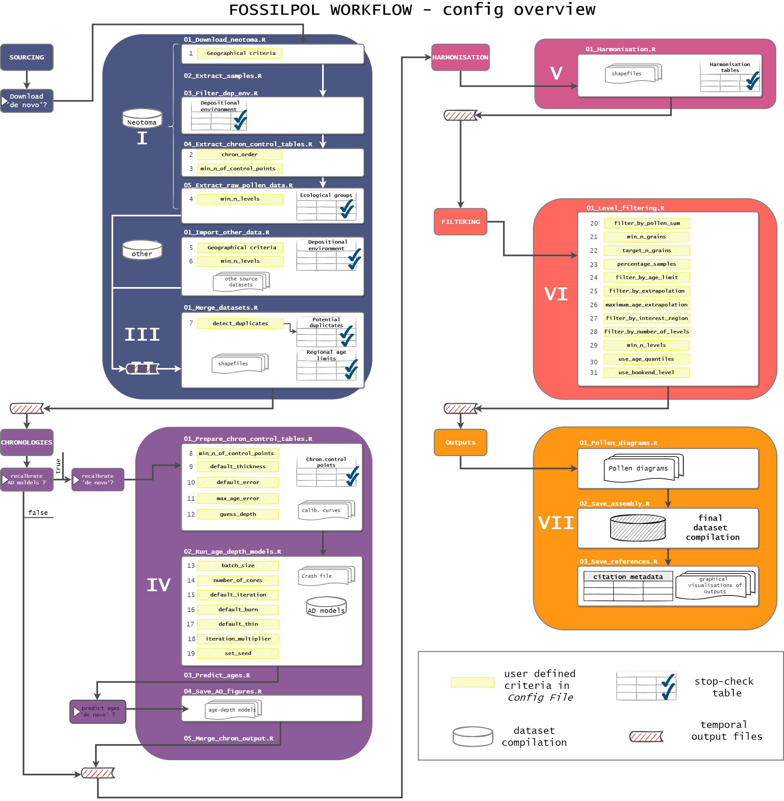

# A step-by-step guide to data processing with FOSSILPOL 

- [Summary](#summary)
  - [Figure 1](#figure-1)
- [Data input](#data-input)
  - [Figure 2](#figure-2)
- [Data storage](#data-storage)
  - [Code block 3](#code-block-3)
- [Data processing](#data-processing)
  - [**I. Data sourcing: `01_Neotoma_source`**](#i-data-sourcing-01_neotoma_source)
    - [Data sourcing (Neotoma) - Scripts](#data-sourcing-neotoma---scripts)
    - [Data sourcing (Neotoma) - Description of individual scripts](#data-sourcing-neotoma---description-of-individual-scripts)
      - [*01\_Download\_neotoma.R*](#01_download_neotomar)
      - [*02\_Extract\_samples.R*](#02_extract_samplesr)
      - [*03\_Filter\_dep\_env.R*](#03_filter_dep_envr)
      - [*04\_Extract\_chron\_control\_tables.R*](#04_extract_chron_control_tablesr)
      - [*05\_Extract\_raw\_pollen\_data.R*](#05_extract_raw_pollen_datar)
        - [Table 1. Ecological groups assigned to pollen taxa as defined in Neotoma](#table-1-ecological-groups-assigned-to-pollen-taxa-as-defined-in-neotoma)
  - [**II. Data sourcing: `02_Other_source`**](#ii-data-sourcing-02_other_source)
    - [Data sourcing (other) - Scripts](#data-sourcing-other---scripts)
    - [Data sourcing (other) - Description of individual scripts](#data-sourcing-other---description-of-individual-scripts)
      - [*01\_Import\_other\_data.R*](#01_import_other_datar)
  - [**III. Initial data processing: `03_Merging_and_geographic_delineation`**](#iii-initial-data-processing-03_merging_and_geographic_delineation)
    - [Initial data processing - Scripts](#initial-data-processing---scripts)
    - [Initial data processing - Description of individual scripts](#initial-data-processing---description-of-individual-scripts)
      - [*01\_Merge\_datasets.R*](#01_merge_datasetsr)
        - [Detection of duplicates](#detection-of-duplicates)
        - [Additional data preparation](#additional-data-preparation)
  - [**IV. Chronologies: `04_Chronologies`**](#iv-chronologies-04_chronologies)
    - [Chronologies - Scripts](#chronologies---scripts)
    - [Chronologies - Description of individual scripts](#chronologies---description-of-individual-scripts)
      - [*01\_Prepare\_chron\_control\_tables.R*](#01_prepare_chron_control_tablesr)
        - [Calibration curves](#calibration-curves)
        - [Types of chronology control points](#types-of-chronology-control-points)
        - [Chronology table preparation](#chronology-table-preparation)
        - [Percentage carbon](#percentage-carbon)
      - [*02\_Run\_age\_depth\_models.R*](#02_run_age_depth_modelsr)
        - [Multi-core computation](#multi-core-computation)
        - [Iterations](#iterations)
      - [*03\_Predict\_ages.R*](#03_predict_agesr)
      - [*04\_Save\_AD\_figures.R*](#04_save_ad_figuresr)
      - [*05\_Merge\_chron\_output.R*](#05_merge_chron_outputr)
  - [**V. Harmonisation: `05_Harmonisation`**](#v-harmonisation-05_harmonisation)
    - [Harmonisation - Scripts](#harmonisation---scripts)
    - [Harmonisation - Description of individual scripts](#harmonisation---description-of-individual-scripts)
      - [*01\_Harmonisation.R*](#01_harmonisationr)
  - [**VI. Data filtering: `06_Main_filtering`**](#vi-data-filtering-06_main_filtering)
    - [Data filtering - Scripts](#data-filtering---scripts)
    - [Data filtering - Description of individual scripts](#data-filtering---description-of-individual-scripts)
      - [*01\_Level\_filtering.R*](#01_level_filteringr)
        - [Pollen count sum](#pollen-count-sum)
        - [Age criteria](#age-criteria)
        - [Level age extrapolation](#level-age-extrapolation)
        - [Interest period](#interest-period)
        - [Number of levels](#number-of-levels)
  - [**VII. Outputs: `07_Outputs`**](#vii-outputs-07_outputs)
    - [Outputs - Scripts](#outputs---scripts)
    - [Outputs - Description of individual scripts](#outputs---description-of-individual-scripts)
      - [*01\_Pollen\_diagrams.R*](#01_pollen_diagramsr)
      - [*02\_Save\_assembly.R*](#02_save_assemblyr)
      - [*03\_Save\_references.R*](#03_save_referencesr)
- [References](#references)

## Summary

The FOSSILPOL Workflow is structured in a modular manner, where all steps are organised sequentially and guided by one main configuration file (*Config file*) where all criteria and setup configurations are pre-defined by the user.

### Figure 1

## Data input

The FOSSILPOL workflow is set up in a way that data from [Neotoma Paleoecological Database](https://www.neotomadb.org/) ("*Neotoma*" hereafter) are the primary data input. However, other data sources can also be used in parallel by using our predefined format ([Fig. 2](#figure-2figure-2)). The user thus has the flexibility to source data from either Neotoma or from another data source as long as our predefined format file is used (see [other data sourcing](#ii-data-sourcing-02_other_source)).

Three additional data inputs are required for the initial set-up of the Workflow:

1. **Configuration file** (`00_Config_file.R`) - this contains all the user-selected settings which will be applied throughout the Workflow. These range from technical settings (e.g. location of the data storage) to specific requirements (e.g. filtering criteria) for records to be included. An overview of where the config critera are used through the Workflow is summaried in ([Fig. 2](#figure-2figure-2)).

2. **Geographical shapefiles** - the workflow is internally set-up in a way that data are processed by geographical regions and shapefiles are used to assign relevant geographical information to the records to process. First, the Workflow is conceptualised for a global project, so the general structure of data processing is done *per continent* (i.e. `region` = "*continent*"), but the user can use any other delineation of interest. The Workflow comes with a default shapefile roughly delimiting continents, but it can be adjusted or replaced as per project needs. Second, the taxonomic harmonisation of records is structured by *harmonisation regions* provided by `harmonisation region shapefile`. By default, this shapefile is a copy of the continental shapefile, but as harmonisation tables are region-specific (see next data input item) this shapefile needs to be adjusted to represent the geographical delimitation of the harmonisation regions used. Finally, if the user is interested in other biogeographic, climatic, or ecological units of interest to be linked to each record (e.g. ecozones, biome type, climate zones), then additional shapefiles (or TIF files) can be added to the workflow (see [details here](step_by_step_guide.html#0301-add)).

3. **Harmonisation tables** - in each project, one harmonisation table must be provided per harmonisation region (delimited by the corresponding harmonisation region shapefile, see above). A harmonisation table always comes with two columns: i) `original taxa`(original taxa) with taxonomic names originally present in Neotoma and/or other data source in the project, and ii) `level_1` (harmonised taxa) with the standardised taxonomic names. The Workflow will detect if a harmonisation table has been provided by the user, or otherwise create a new table with all detected *raw* taxa names for each harmonisation region. The latter can consequently serve as a template for harmonisation in the `level_1` column (see [details here](step_by_step_guide.html#05)).

### Figure 2

## Data storage

The Workflow will produce several files including *temporary output files*, *stop-check* tables, and final *outputs* (data assembly, figures, etc.):

1. **Temporary output files**: the Workflow is set up in a way that temporary (in-progress) data files are saved at various stages of the Workflow. Each file will contain the date of creation for easier organisation. When run multiple times, the Workflow will automatically detect if there are any changes in a selected file and only overwrite it, if an updated file is produced (this is powered by [`{RUtilpol}` package](https://github.com/HOPE-UIB-BIO/R-Utilpol-package)). This also means that the user does not have to re-run the whole Workflow but can re-run only specific parts. As the total size of the files can become substantial, the user can specify if all files should be stored within the project folder (default) or in another directory (specified by using the `data_storage_path` in the Config file). With such specification, and after running the `00_Config_file.R` script, there will be an additional folder structure created (see [Code block 3](#code-block-3)).

2. ***stop-checks* CSV tables**: while running the Workflow, there will be several times that a user will be asked to check and, where necessary, adjust the produced CSV tables to subsequently continue with the Workflow (i.e. re-run script). This is done to oblige the user to check the produced intermediate results before continuing. For example, at a certain point, the Workflow will produce a list of all ecological groups detected within the dataset compilation obtained from Neotoma. A user then has to edit the mentioned CSV table and specify, which ecological groups should be kept (`include` = `TRUE`) and which should be filtered out (`include` = `FALSE`). Note that there are several stop-checks throughout the Workflow (see overview in [Fig. 2](#figure-2figure-2)).

3. **Workflow output** (`Outputs/`, see [Section VII](#vii-outputs-07_outputs) for more information):
    - a ready-to-use, taxonomically harmonised and temporally standardised compilation of fossil pollen data, ready for the analytical stage (rds format)
    - plots of modelled age-depth curves for each record (pdf format)
    - pollen diagram of each record (pdf format)
    - metadata table relaying the main data contributor, contact information, and corresponding publications for citation purposes of the used datasets (PDF).
    - reproducibility bundle, a zip file with contains all important sections for a reproducibility of the whole project.  
    - overview figures of the spatial and temporal distribution of the dataset compilation, namely a map and a graph of the record lengths, respectively (PDF).

### Code block 3

```{r}
data_storage_path
│
└───Data
│   │
│   └───Input
│   │   │
│   │   └───Chronology_setting
│   │   │   │
│   │   │   └───Bchron_crash
│   │   │   │
│   │   │   └───Chron_control_point_types
│   │   │   │
│   │   │   └───Percentage_radiocarbon
│   │   │
│   │   └───Depositional_environment
│   │   │   │
│   │   │   └───Neotoma
│   │   │   │
│   │   │   └───Other
│   │   │
│   │   └───Eco_group
│   │   │
│   │   └───Harmonisation_tables
│   │   │
│   │   └───Neotoma_download
│   │   │
│   │   └───Potential_duplicates
│   │   │
│   │   └───Other
│   │   │
│   │   └───Regional_age_limits
│   │   
│   └───Personal_database_storage
│   │
│   └───Processed
│       │
│       └───Chronology
│       │   │
│       │   └───Chron_tables_prepared
│       │   │
│       │   └───Models_full
│       │   │
│       │   └───Predicted_ages
│       │   │
│       │   └───Temporary_output
│       │
│       └───Data_filtered
│       │
│       └───Data_harmonised
│       │
│       └───Data_merged
│       │
│       └───Data_with_chronologies
│       │
│       └───Neotoma_processed
│       │   │
│       │   └───Neotoma_chron_control
│       │   │
│       │   └───Neotoma_dep_env
│       │   │
│       │   └───Neotoma_meta
│       │
│       └───Other
│ 
└───Outputs
    │
    └───Data
    │
    └───Figures
    │   │
    │   └───Chronology
    │   │
    │   └───Pollen_diagrams
    │   
    └───Tables
        │
        └───Meta_and_references
```

## Data processing

Here we focus on the scripts within the `R/01_Data_processing` folder representing all steps needed for data processing (from obtaining data to the final dataset compilation), organised in the following Sections:

(I) **[Data sourcing: `01_Neotoma_source`](#i-data-sourcing-01_neotoma_source)** - retrieve and process data from Neotoma

(II) **[Data sourcing: `02_Other_source`](#ii-data-sourcing-02_other_source)** - process data from other data source (optional)

(III) **[Initial data processing: `03_Merging_and_geographic_delineation`](#iii-initial-data-processing-03_merging_and_geographic_delineation)** - merge data sources, filter out duplicates, and assign values based on geographical location

(IV) **[Chronologies: `04_Chronologies`](#iv-chronologies-04_chronologies)** - prepare chronology control tables, calculate age-depth models, and predict ages for levels

(V) **[Harmonisation: `05_Harmonisation`](#v-harmonisation-05_harmonisation)** - prepare all harmonisation tables and harmonise pollen taxa (morphotypes)

(VI) **[Data filtering: `06_Main_filtering`](#vi-data-filtering-06_main_filtering)** - filter out levels and records based on user-defined criteria

(VII) **[Outputs: `07_Outputs`](#vii-outputs-07_outputs)** - save the final output including dataset compilation, pollen diagrams, metadata information, graphical summary snd reproducibility bundle

### **I. Data sourcing: `01_Neotoma_source`**

#### Data sourcing (Neotoma) - Scripts

- `Run_01_01.R`- run all scripts within this folder

- [`01_Download_neotoma.R`](#01_download_neotomar)- download the pollen data from the Neotoma database

- [`02_Extract_samples.R`](#02_extract_samplesr) - create a table from Neotoma´s downloaded lists and download author information

- [`03_Filter_dep_env.R`](#03_filter_dep_envr) - get depositional environment data and filter out records based on the user preferences

- [`04_Extract_chron_control_tables.R`](#04_extract_chron_control_tablesr) - get chronologies, including the preferred table with chronology control points

- [`05_Extract_raw_pollen_data.R`](#05_extract_raw_pollen_datar) - extract the raw pollen counts from Neotoma and filter by user-selected ecological groups.

#### Data sourcing (Neotoma) - Description of individual scripts

##### *01_Download_neotoma.R*

All pollen records are downloaded from Neotoma based on the geographical criteria (spatial extent, [Fig. 2](#figure-2figure-2) - config criteria **1**) and the selected data type, in this case: `"pollen"`. Note that a more complex spatial extent, like a polygon, can be used with the `loc` argument in `RFossilpol::proc_neo_get_all_neotoma_datasets()`(see usage of `loc` in `neotoma2` example [here](https://github.com/NeotomaDB/EPD_binder/blob/main/slides/slides2.pdf)).

##### *02_Extract_samples.R*

Each record is processed using a unique dataset ID (`dataset_id`) with metadata information extracted. Metadata includes information about the name of the record, geographical information, and the authors and publication DOI connected to the dataset. The authors and their link to the dataset are saved into a separate Author-Dataset database created specifically for each project. It allows easy extraction of authors and DOI for the final dataset compilation produced by the Workflow.

##### *03_Filter_dep_env.R*

Depositional information from each record gives information about the environments where a record was extracted. Based on the research question, there could be a preference for certain environments (e.g. terrestrial vs. marine). Currently in Neotoma, the data about depositional environments are organised in a hierarchical structure (e.g. "*Pond*" is nested in "*Natural Lake*", which is nested in "*Lacustrine*"), in which the maximum number of nested layers is five. At the lowest hierarchical level, there are currently over 50 different categories of depositional environments (for fossil pollen records). Based on the selected records, the Workflow will produce a list of all depositional environments (and their hierarchical position) present in the user´s data selection. The user is then requested to define the environments of choice (this is a [***stop-check***](#data-storage) point, [Fig. 2](#figure-2figure-2)). Note that excluding depositional environments with the higher hierarchical position will **not** automatically exclude all depositional environments nested in it.

##### *04_Extract_chron_control_tables.R*

Chronology data for each record is available in a table that contains information about chronology control points used to construct an age-depth model. Some records can have multiple chronology tables as some records have been used for several projects or recalibrated (updated) by data stewards. These tables are numbered according to the order in which they were created and uploaded. Each chronology comes with the age-unit of the age-depth model output (e.g. "*Radiocarbon years BP*", "*Calibrated radiocarbon years BP*") and the temporal range of the record (youngest and oldest age). The chronologies in "*Radiocarbon years BP*" are often older chronologies as it is now common practice to recalibrate radiocarbon-dated material and produce chronologies expressed in "*Calibrated radiocarbon years BP*". Note: The chronologies in "*Calibrated radiocarbon years BP*" still come with chronology table(s) containing the uncalibrated radiocarbon ages and need to be calibrated by the user if a new age-depth model is desired. The Workflow automatically selects one table per record based on the order defined by `chron_order` in the Config file ([Fig. 2](#figure-2figure-2) - config criteria **2**).  Note: if more tables have the same age-unit type (e.g. Calibrated radiocarbon years BP), the Workflow will opt for the more recent table. The user can specify their preference for certain age-unit types in the Config file. In addition, only records which have at least a certain number of control points (defined by `min_n_of_control_points` in the Config file, [Fig. 2](#figure-2figure-2) - config criteria **3**) will be subsequently used.

##### *05_Extract_raw_pollen_data.R*

Each level of each record comes with additional information: a) unique sample ID (sample_id), b) information about depth (and estimated age later), and c) pollen counts for each taxon present in that level. The information about levels is split into two different tables (first with depth and ages, and second with pollen counts) linked together by sample ID (`sample_id`).

The Workflow will only keep records with a minimal number of levels as defined in the Config file (`min_n_levels`, [Fig. 2](#figure-2figure-2) - config criteria **4**). The minimum number of levels is by default selected as three but the user can change this setting.

In the case of data sourced from Neotoma, each pollen taxon has information about the ecological group (e.g. palms, mangroves, etc). Based on the selected records, the Workflow will produce a full list of all ecological groups after which the user is requested to define which ecological groups to include (a [***stop-check***](#data-storage) point, [Fig. 2](#figure-2figure-2), see explanation of abbreviation in [Table 1](#table-1-ecological-groups-assigned-to-pollen-taxa-as-defined-in-neotoma))

###### Table 1. Ecological groups assigned to pollen taxa as defined in Neotoma

ABBREVIATION  | ECOLOGICAL GROUP
----          | ----
ACRI          | Acritarchs
ANAC          | Anachronic
ALGA          | Algae (e.g. Botryococcus)
AQB           | Aquatics (e.g. Sphagnum)
AQVP          | Aquatic vascular plants (e.g. Isoetes)
BIOM          | Biometric measurements
EMBR          | Embryophyta
FUNG          | Fungi
LABO          | Lab analyses
MAN           | Mangroves
PALM          | Palms
PLNT          | Plant
SEED          | Unidentified, but definitely pollen - Spermatophyte rank or clade
SUCC          | Succulents
TRSH          | Trees and shrubs
UNID          | Unknown and Indeterminable
UPBR          | Upland bryophytes
UPHE          | Upland herbs
VACR          | Terrestrial vascular cryptogams
VASC          | Vascular plants

### **II. Data sourcing: `02_Other_source`**

Our FOSSILPOL Workflow allows the use of other data source in combination with the Neotoma data. Including other data sources is fully optional and can be skipped as indicated by `use_other_datasource` = `TRUE`/`FALSE` in the Config file.

Any data can be used as long as it contains the following required information: a) metadata, b) depositional environment, c) chronology, d) level (age-depth), and e) pollen counts. In order to prepare data for usage, the user needs to download [file template](https://figshare.com/articles/dataset/FOSSILPOL-private_data-template/19794112) specially prepared for this. Each pollen record needs to be stored as a separate file with **unique** name. We recommend e.g., `private_data_(insert_site_name).xlsx`. The *site name* in the filename is crucial as it will be compared against all other pollen records in Neotoma to test for potential duplicates in a later stage of the Workflow. All files must be stored in `/Data/Input/Other/` (or specified by `dir_files` argument, see below).

#### Data sourcing (other) - Scripts

- `Run_01_02.R` - run all scripts within this folder
- [`01_Import_other_data.R`](#01_import_other_datar) -  source other data sources and filter the records in a similar way as Neotoma.

#### Data sourcing (other) - Description of individual scripts

##### *01_Import_other_data.R*

The sourcing of other data sources follows a simple order of actions:

1. Data files need to be prepared by the user following the template one record per file.

2. Data are extracted and formatted to be compatible with Neotoma data using the `RFossilpol::import_datasets_from_folder()` function, with the following arguments:
   - `dir_files` - user can specify which folder contains the prepared data (default = `Data/Input/Other/`
   - `suffix` - argument to keep track of the source of the data. Default is set to `"other"`, which means that datasets can be easily identified as their name will be `(dataset id)_other`
   - `source_of_data` - will flag the source of each dataset in the compilation in meta-data overview (see [section VII](#vii-outputs-07_outputs)). Default is set to `"personal_data"`
   - `data_publicity` - will flag the data publicity of each dataset in the compilation in meta-data overview (see [section VII - Outputs](#vii-outputs-07_outputs)). Default is set to `"restricted"`
   - `pollen_percentage` - pollen counts measured as proportions (e.g., from scanning of pollen diagrams) can be flagged here. Default set to `FALSE`

3. Names of data contributors are extracted and added to the [Author-Dataset database](#02_extract_samplesr) used in Author-dataset attribution (see [section VII - Outputs](#vii-outputs-07_outputs)).

4. Data are treated in a similar way as data from Neotoma, in terms of filtering by geographical location, number of levels ([Fig. 2](#figure-2figure-2) - config criteria **5**,**6**), and depositional environments ([***stop-check***](#data-storage) point, [Fig. 2](#figure-2figure-2)).

### **III. Initial data processing: `03_Merging_and_geographic_delineation`**

#### Initial data processing - Scripts

- `Run_01_03.R` - run all scripts within this folder
- [`01_Merge_datasets.R`](#01_merge_datasetsr) - merge data from all sources, filter out duplicates, and assign values based on geographical location

#### Initial data processing - Description of individual scripts

##### *01_Merge_datasets.R*

After initial data processing, records from Neotoma and Other sources are merged together.  

###### Detection of duplicates

There is a possibility that some datasets from the other data sources are already in Neotoma. To avoid duplication within the final dataset compilation, the Workflow will compare datasets from both sources and identify potential duplicates. This step is optional but recommended to follow. To do so, the user needs to specify that `detect_duplicates` == `TRUE` in the Config file (this is set as default, [Fig. 2](#figure-2figure-2) - config criteria **7**). The Workflow will start a simple subroutine using the function `RFossilpol::proc_filter_out_duplicates()`. Because comparing all records within each data source to each other is relatively computationally demanding, the function will split the data into several groups using their geographical location (ca. 100 records per group). The user can define the number of groups using the `n_subgroups` argument. Next, each record from one source is compared to all records from the other source as long as they are within 1 degree radius (the assumption here is that duplicated records will be in a similar location). The user can define the maximum distance using the `max_degree_distance` argument. Finally, the Workflow will output a list of potential duplicated records (a [***stop-check***](#data-storage) point, [Fig. 2](#figure-2figure-2)). For each record-pair, the user must specify, which records should be deleted by writing `1` (deleting the Neotoma) or `2` (deleting the other data source) in the `delete` column of the created list (leaving `0` will leave both records in).

###### Additional data preparation

Several more steps take place to create the fully merged dataset compilation before proceeding to the chronology step (does not require any action by user):

1. All taxon names are transformed into a more computer-friendly format for easier manipulation. The `RFossilpol::proc_clean_count_names()` function will first transform special characters to text (e.g. `+` to `_plus_`) and then use the [{janitor} package](https://sfirke.github.io/janitor/) to transform into ["*snake_case*" style](https://en.wikipedia.org/wiki/Snake_case). In addition, the user can specify additional specific changes in names (e.g. based on presence of special characters) by adjusting the `user_name_patterns` argument (see example in the script). During this cleaning of taxa names, the Workflow will save `taxa_refrence_table` for back traceability to Neotoma taxonomy. The `taxa_reference_table` is a CSV file saved in the same folder as the harmonisation tables (`Data/Input/Harmonisation_tables/`). More about [harmonisation process](#v-harmonisation-05_harmonisation).

2. Individual levels (sample depths) are sorted by their depth for each record by `RFossilpol::proc_prepare_raw_count_levels()`. This includes subroutines, for example, only keeping levels present in all data tables, filtering out levels without pollen data, and taxa which are not present in any level.

3. Spatial information for each record is assigned based on the provided geographical shapefiles. Specifically:
  
    - **Region information** - the shapefile in `Data/Input/Spatial/Regions_shapefile` will assign the regional names for each record (see [Data input Section](#data-input)). The user can (and is recommended to) change the spatial delineation of the data by altering or replacing the shapefile.
  
    - **Political delineation (countries)** - obtained from [GADM database](www.gadm.org), version 2.8, November 2015.
  
    - **Harmonisation region** - the shapefile in `Data/Input/Spatial/Harmonisation_regions_shapefile` will assign the harmonisation region (to be able to link the corresponding harmonisation table to use; See see [Data input Section](#data-input)). The default shapefile in the Workflow is a copy of the Region information shapefile but should be adjusted by the user to correspond to the area covered by the different harmonisation tables.
  
    - **Calibration curves (normal and post-bomb)** - depending on the geographical position of the record, a different calibration curve needs to be assigned, as different curves are used for the northern and southern hemispheres, and for terrestrial and marine environments. See more details about [calibration curves](#calibration-curves).

    - **Additional** - The user can add any additional spatial delimitation (e.g. ecozones). This will require adding the specific shapefile (or TIF file) in `/Data/Input/Spatial/NAME_OF_FOLDER` and adjusting the R code manually (`optional_info_to_assign`) so that the shapefile is sourced, and its information assigned to each record (see the example in the script).  

4. The Workflow will create a new table with age limitations for each region presented in the data, which needs to be edited by the user (a [***stop-check***](#data-storage) point, [Fig. 2](#figure-2figure-2)). For example, `Regional_age_limits` table will have the following values:
    - `young_age` = youngest age the record must have
    - `old_age` = oldest age the record must have
    - `end_of_interest_period` = levels beyond this age will be omitted

### **IV. Chronologies: `04_Chronologies`**

To estimate the age of individual levels based on their depth, an age-depth model needs to be constructed based on the chronology data of the record. An age-depth model will provide age estimates of each individual level and the full age range of the record.

Age-depth modelling can be very computationally heavy and can take a substantial amount of time. Therefore, the Workflow automatically processes several files (rds format):

- *Chronology-control-tables*:
  - `/Data/Processed/Chronology/Chron_tables_prepared/chron_tables_prepared*.rds` contains all the chronology control tables prepared to be re-calibrated

- *Age-depth-models*:
  - `/Data/Processed/Chronology/Models_full/*` contains one file for each age-depth model

- *Predicted-ages*:
  - `/Data/Processed/Chronology/Predicted_ages/predicted_ages*.rds` contains the predicted ages using the age-depth models

It may be **not** preferential to re-run all age-depth models every time the user wants to re-run the Workflow. Therefore, the Workflow offers the option to save the successful age-depth models (*Age-depth-models* & *Predicted-ages*) and keep them between individual runs. This can be done in several ways:

- `recalib_AD_models` in the Config file can be set to `FALSE`. This will result in completely omitting the scripts aimed at calculating age-depth models, and therefore this step will be skipped. Note that this will only work if the age-depth models have already been successfully created at least once (*Predicted-ages* exists).

- `calc_AD_models_denovo` in the Config file can be set to `FALSE` (this is the default). When set to `TRUE`, the Workflow will **not** use the *Age-depth-models* files (successful age-depth models) and will re-calibrate everything "*de novo*".

- `predict_ages_denovo` in the Config file is set to `FALSE` as the default. When set to `TRUE`, the Workflow will use all the age-depth model files but re-assign the ages to each level of all related records (even for records where ages were successfully predicted). This is done, for instance, when the number of levels in a record increased since the last Workflow run and these levels still need to have ages assigned.

**IMPORTANT NOTE**: If you select both `calc_AD_models_denovo` and `predict_ages_denovo` as `FALSE` for your first run of age-depth modelling, you might be asked by the Workflow to temporarily switch both to `TRUE` in the console (you do not have to change anything in the Config file).

#### Chronologies - Scripts

- `Run_01_04.R` - run all scripts within this folder
- [`01_Prepare_chron_control_tables.R`](#01_prepare_chron_control_tablesr) - prepare the chronology tables for age-depth modelling
- [`02_Run_age_depth_models.R`](#02_run_age_depth_modelsr)- create age-depth models with BChron
- [`03_Predict_ages.R`](#03_predict_agesr) - estimate the ages of individual levels
- [`04_Save_AD_figures.R`](#04_save_ad_figuresr) - save visual output of the age-depth models in pdf format
- [`05_Merge_chron_output.R`](#05_merge_chron_outputr) - link age-depth models to corresponding datasets

#### Chronologies - Description of individual scripts

##### *01_Prepare_chron_control_tables.R*

Age-depth models are constructed using *chronology control points* (usually radiocarbon dates) with known depth, estimated age, and associated age uncertainties. Each record can and should ideally have several such points saved in the *chronology control table*. Each chronology control point has the following properties:

- Depth
- Estimated age
- Error of the estimated age
- Type of the chronology control point
- The calibration curve used (which is needed to convert the raw radiocarbon ages to calendar ages (Note: radiocarbon *ages* are not true calendar ages!)).

This script will take several steps to prepare all records for age-depth modelling, specifically:

1. Create and attach the necessary calibration curves
2. Select the preferred chronology control point types
3. Prepare chronology tables (include fixing issues with percentage carbon (if necessary))

###### Calibration curves

Calibration curves are assigned to each control point based on several criteria. If a control point has a type flagged to be calibrated (see next section), a calibration curve is assigned based on the geographical position of the record. Note: only chronology control points of uncalibrated radiocarbon ages need recalibration. FOSSILPOL has a shapefile based on figure 7 in Hogg et al (2020) to correctly assigned IntCal20, SHCal20 and a mixed calibration curve to each record. We follow this recommendation "*...the use of (i) IntCal20 for areas north of the ITCZ in June-August (dashed lines in Figure 7) which receive NH air masses all year round, (ii) SHCal20 for areas south of ITCZ in December-February (dotted lines in Figure 7) which see SH air masses all year round, and (iii) a mixed curve for areas between the two seasonal ITCZ positions shown in Figure 7, which receive northern air masses in December-February and southern air masses in June-August.*" FOSSILPOL also comes with a mixed curve that was constructed using the [`{rcarbon}` package](https://github.com/ahb108/rcarbon) with a proportion of curve contribution 1:1. See [more info](https://chrono.qub.ac.uk/blaauw/clam.html) on mixed calibration curve use.

All calibration curves have an age limitation, i.e. each curve can be used only for certain ages. Radiocarbon calibration curves currently do not cover ages older than 55 thousand years. For the younger ages, during the last century, there are issues with the Earth's atmospheric radiocarbon and a different set of calibration curves needs to be used. This is caused by the deployment of nuclear weapons in the '50s and '60s, which caused a spike in atmospheric radiocarbon and resulted in radiocarbon measurements from material in the following decades to return often highly negative ages. Therefore, if the control point has a radiocarbon age younger than 200 yr BP, a *post-bomb calibration curve* is used instead (see further below). As with the normal calibration curves, the geographical location of the record is taken into account to assign the corresponding post-bomb calibration curve.

Modern radiocarbon dates are calibrated by using one of the post-bomb calibration curves (`nh_zone_1`, `nh_zone_2`, `nh_zone_3`, `sh_zone_1_2`, `sh_zone_3`), following Hua et al., 2013 and [link](http://calib.org/CALIBomb/). The Workflow will automatically assign the corresponding curve based on the geographical location of the record (see function `IntCal::copyCalibrationCurve()`). If modern radiocarbon dates are detected, the Workflow will then display the detected records to the user and apply the conversion according to the post-bomb curves from the [`{IntCal}` package](https://cran.r-project.org/web/packages/IntCal/index.html).

###### Types of chronology control points

Each control point in the control table has several properties: unique ID, depth, age, error, thickness, and chronology control point type (e.g. radiocarbon, biostratigraphic, annual laminations, tephra). Each type of chronology control point has different age uncertainties. For instance, many older records relied on indirect dating techniques based on biostratigraphic layers, similar geological levels from other records (e.g. a volcanic event), and pollen-based levels (e.g. the appearance of a key taxon), among others and can have large age uncertainties into thousands of years. Neotoma has over 50 different chronology controls points that fall within the categories of geochronological (e.g. lead-210, radiocarbon, uranium-series),  relative time scale (e.g. MIS5e, Heinrich Stadial 1,  Late Wisconsin event), stratigraphic (e.g. biostratigraphic events such as the introduction of anthropogenic taxa), cultural (e.g. European Settlement Horizon), other absolute dating methods (e.g. annual laminations, collection date), and other dating methods (e.g. extrapolated or guesses). Only the chronology control points in uncalibrated radiocarbon ages require recalibration with the calibration curves as most, if not all, other control points will be in calendar ages and no recalibration should be implemented.

A user has the option to select which control point types should be accepted "as-is" and which should be calibrated (a [***stop-check***](#data-storage) point, [Fig. 2](#figure-2figure-2)). The Workflow will automatically produce a list of all detected control points from all selected records, which includes columns called `include` and `calibrate`. In the first, the user should indicate if the chronology control point should be included. In latter, the user should indicate if the point should be recalibrated using the calibration curves, here uncalibrated radiocarbon ages.

###### Chronology table preparation

The chronology control tables will need to undergo a number of user-defined adjustments:

- filtering out unwanted control point types selected by user (defined by [***stop-check***](#data-storage) point, see above)

- filtering out records that do not fulfil the minimal number of control points (defined by `min_n_of_control_points` in the Config file, default = 2, [Fig. 2](#figure-2figure-2) - config criteria **8**). The value `min_n_of_control_points` will serve as a criterion for the prepared chronology control tables, where records that do not fulfil such requirements will be filtered out. Note that there is a trade-off between accepting only the tables with a high number of control points per time interval (more robust age-depth model) and the number of records that will be able to fulfil strict criteria.

- fixing instances of missing values. Defined in the Config file, the values `default_thickness` (defined in the Config file, default = `1`, [Fig. 2](#figure-2figure-2) - config criteria **9**) and `default_error` (default = `100`, [Fig. 2](#figure-2figure-2) - config criteria **10**) will replace missing values (`NA`) for thickness and error, specifically.

- filtering out control points with an error that is considered too big. Any control point with an error bigger than `max_age_error` (defined in the Config file; default = `3000` yr, [Fig. 2](#figure-2figure-2) - config criteria **11**) will be filtered out.

- removing control points that are duplicated in terms of age and/or depth.

- in several cases, the chronology control point from the core-top has a type specified as `guess`. A user can specify that the type `guess` is only acceptable to a certain depth using the `guess_depth` variable in the Config file (default is `10` cm, [Fig. 2](#figure-2figure-2) - config criteria **12**)

In addition, the number and distribution of such control points can give a good indicator of the temporal uncertainty around levels' ages (Giesecke et al. 2014 [VHA], Flantua et al. 2016 [CP]). For example, a record with few chronology control points within the focus time period will have large uncertainties of predicted ages. Hence, the information of the quality of chronologies, i.e. taking into account the types and levels of chronology control points, can be a criterion used in the selection of records.

###### Percentage carbon

There are three ways by which post-bomb radiocarbon dates are reported, namely by 1) modern radiocarbon dates (<0 F14C yr); 2) percent modern carbon (pMC, normalised to 100%); and 3) fraction radiocarbon (F14C, normalised to 1; Reimer et al. 2004). Currently, there is no direct way to know from Neotoma whether the dates are in pMC or F14C. Even if the cases are likely to be few, such dates need to be checked to avoid incorrect calculations.

The strongest rule of thumb is that normal radiocarbon dates and errors should always be integer (no decimals) and are uploaded so by the data stewards to Neotoma. The second rule of thumb is that pMC control points are characterised by an age value from around 100 with a decimal place. Thus, the Workflow will automatically export suspicious records and the user must specify which control points should be back-transformed (a [***stop-check***](#data-storage) point, ([Fig. 2](#figure-2figure-2)).). For those selected by the user to be back-transformed (`include` == `TRUE`), the Workflow will first convert the pMC values to *normal* post-bomb radiocarbon ages (negative 14C ages) by using the `IntCal::pMC.age()` function, after which normal post-bomb calibration curves are used to calibrate the values to final calendar ages (see above).

Although F14C has been recommended by experts for the reporting of post-bomb samples (Reimer et al. 2004 [Radiocarbon], in practice, the bulk of the reporting is done as modern radiocarbon dates followed by pMC to a much lesser extent. The Workflow currently does not deal with F14C as no such cases have been detected to date. As this is not consistent with the rest of the data, back-transformation could be done when working with other data sources, and the [`{IntCal}` package](https://cran.r-project.org/web/packages/IntCal/index.html) can be used to do so.

##### *02_Run_age_depth_models.R*

Individual age-depth models are estimated using the [`{Bchron}` package](http://andrewcparnell.github.io/Bchron/), which estimates the Bayesian probabilistic trajectory of the age-depth model curve (non-parametric chronology model to age-depth data according to the Compound Poisson-Gamma model). Therefore, it is suitable for various combinations of control point types, outliers, and age reversals.

If there are many ages at close or similar depths (e.g. annual laminations), initialisation problems may occur and the Bchron could fail to converge the age-depth model. In such a scenario, the thickness of duplicated chronology control points is automatically increased by 0.01 (see `artificialThickness` argument in `Bchron::Bchronology()` function).

###### Multi-core computation

Because creating age-depth models for multiple records can be computationally demanding, the Workflow uses multi-core (*parallel*) computation. The Workflow automatically detects the number of cores for the machine on which the code is running (this can be adjusted by specifying the number in `number_of_cores` in the Config file, [Fig. 2](#figure-2figure-2) - config criteria **14**). Several age-depth models are then created at the same time. This is done by splitting the records into batches, with each batch containing a certain number of records (see `batch size` in Config file, [Fig. 2](#figure-2figure-2) - config criteria **13**; by default it is based on the `number_of_cores`). If `number_of_cores` is selected (or detected) as `1`, the Workflow will not use the batch approach (as obsolete) and estimate the age-depth models one-by-one (see below).

Note that there is a possibility that the age-depth model estimation will crash (freeze) for unforeseen reasons. Therefore, the Workflow is structured in a way that if an estimation of the whole batch crashes, the Workflow will skip that batch and continue with other batches. The user can specify how long the machine should wait before skipping the batch with the `time_per_record` argument in the `RFossilpol::chron_recalibrate_ad_models()` function.

For each batch, the Workflow will try to estimate age-depth models three times. The user can specify the number of attempts by changing the `batch_attempts` in the `RFossilpol::chron_recalibrate_ad_models()` function. If the age-depth modelling is stopped in the process, the Workflow will automatically use the previously successful batches, which are saved automatically. This should help when the user needs to stop the age-depth modelling and resume it at a later time.

Next, the Workflow continues to another subroutine where age-depth models for records from *failed* batches are estimated one by one. Similar to batch estimation, the age-depth model estimation is tried three times for each *crashed* record until successful at least once. On some rare occasions, a record could cause R to freeze completely and prevents it from skipping to another record. In that case, the dataset ID of the dataset that caused the crash will be automatically written in the *Crash file* (found in `/Data/Input/Chronology_setting/Bchron_crash/`) and omitted from the future run of age-depth models. The user is recommended to do a detailed check of the specific dataset, e.g. the chronology control table for possible inconsistencies or other flaws that could be causing `{BChron}` to fail to produce an age-depth model.

###### Iterations

In the Config file, the number of iterations is set to `50,000` by default, discarding the first `10,000` iterations (*burn-in*) and keeping every iteration beyond the burn-in with a step size of `40` (*thinning*) ([Fig. 2](#figure-2figure-2) - config criteria **15**,**16**,**17**). The user can change the number of iterations by altering the `iteration_multiplier` in the Config file ([Fig. 2](#figure-2figure-2) - config criteria **18**). This will result in changing the total interactions but keeping the ratios of burn-ins and thinning. Thus `1000` ((`50k` - `10k`) / `40`) posterior values are drawn. The default number of iterations should produce a robust estimation but they can be increased by the user if preferred (by increasing the `iteration_multiplier`). Note that increasing the `iteration_multiplier` will automatically increase the time that the program will wait for estimation of an age-depth model before skipping it (see `time_per_record` above).

The user should keep in mind that creating age-depth models for hundreds of records using a high number of iterations is computationally demanding and can take a significant amount of time in the order of tens of hours or several days.

##### *03_Predict_ages.R*

With a successful age-depth model, the ages of individual levels are estimated. The Workflow will estimate age and the error estimate for each level, which will encapsulate 95% of all age posterior values (*upper* and *lower* boundary). As `{BChron}` uses a probabilistic model it is possible to obtain *possible* ages of each level. To do so, a number of ages (default = `1000`, see above) are drawn from the model posterior representing all the *possible* ages, and a series of quantiles of various values (`25`, `50`, `75`, etc.) are then calculated. The 50th quantile (*median*) is used as the final age of each level, and the 2.5th and 97.5th quantiles as upper and lower boundaries respectively. This results in the age estimate of each level including its error estimates. The whole matrix *levels by posterior drawn (possible age)* is saved as an *age uncertainty matrix* (`age_uncertainty` column). This whole process is completely automated and does not require any input from the user.

##### *04_Save_AD_figures.R*

The visual representation of all age-depth models is saved as output for visual confirmation of successful model estimation. The files (as PDFs) are stored in the `/Outputs/Figures/Chronologies/` folder and split into subfolders defined by region. The properties of the figures (size of figures, font size, etc) can be altered in the Config file (`image_width`, `image_height`, `image_units`, `image_dpi`, `text_size`, `line_size`). They can be used for inspection of the age-depth curves to look for unrealistically large age estimates or error bars, hiatuses, or extreme extrapolations toward the present or the past.

##### *05_Merge_chron_output.R*

The successfully predicted ages are linked with all the records from the various sources (Sections I-III). The individual levels of each record are then ordered by the predicted ages and the same order of levels is then applied to the tables with the pollen counts.

### **V. Harmonisation: `05_Harmonisation`**

The goal of taxonomic harmonisation is to standardise all site-level names to the same pollen morphotypes (set of pollen and spore morphotypes used for all pollen records) and thus reduce the effect of taxonomic uncertainty and nomenclatural complexity (See relevant literature in Appendix 1 of Flantua et al. 2023, GEB).  For this purpose, a *harmonisation table* can be created that groups the morphotypes into the highest taxonomic level that is most likely to be identified by most of the pollen analysts.

#### Harmonisation - Scripts

- `Run_01_05.R` - run all scripts within this folder
- [`01_Harmonisation.R`](#01_harmonisationr) -  prepare all harmonisation tables and harmonise the raw counts.

#### Harmonisation - Description of individual scripts

##### *01_Harmonisation.R*

First, the Workflow will check the *harmonisation regions* present in the data, defined by the shapefile (see [Data input](#data-input) and [Section III](#additional-data-preparation)), and confirm that there is one harmonisation table per region (a [***stop-check***](#data-storage) point, [Fig. 2](#figure-2figure-2)). If any table is missing (or the Workflow is run for the first time), the Workflow will automatically create a harmonisation table per harmonisation region, with all the raw taxa names from all the records from within that region. Note that we refer here to "taxon names" for simplicity but the identification is often done at the level of family or genus, and are best referred to as morphotypes.

Each harmonisation table is created so that each taxon can have two columns:

i. `taxon_name` which is the original name of the taxon (morphotype) formatted into a more computer-friendly format (*snake_case*)

ii. `level 1`, which should be used to merge various taxa (morphotypes) into harmonised taxonomic units, specific for the project.

Note that in order to link the names to the original display in Neotoma, user can use the `taxa_reference_table` (see [name cleaning process](#additional-data-preparation)).

The user can also define which taxa should be completely removed during the harmonisation process (marked as `delete`), in case of a taxonomic mistake or a palaeoecological proxy not of interest, e.g. spores). The user can add additional columns (e.g. `level_2`) and then specify which levels should be included by altering the argument `harm_name` when using the `RFossilpol::harmonise_all_regions()` function.

With these tables, each dataset is harmonised so that all taxa that belong to the same harmonised taxa (morphotypes) are summed together in each level - this process is applicable for both count and percentage data. This process includes automatic detection of successful pollen harmonisation by checking the total number of pollen grains before and after harmonisation (it can be turned off by changing the argument `pollen_grain_test` to `FALSE` when using the `RFossilpol::harmonise_all_regions()` function).

### **VI. Data filtering: `06_Main_filtering`**

To obtain a comprehensive dataset compilation of multiple fossil pollen records, to increase its overall quality, and to answer research questions reliably, we recommend the user to further trim down the data selection by filtering out individual levels and/or whole records. All of these filtering criteria can be adjusted by the user in the Config file:

- `filter_by_pollen_sum` ([Fig. 2](#figure-2figure-2) - config criteria **20**) - if `TRUE`, the Workflow will use the quantity of counted pollen grains at each level as a factor in determining the quality of the level.

- `filter_by_age_limit` ([Fig. 2](#figure-2figure-2) - config criteria **24**) - if `TRUE`, the Workflow will filter out records that do not span the user-defined time period (defined by `young_age` and `old_age` in `Regional_age_limits` table; see [Section III](#iii-initial-data-processing-03_merging_and_geographic_delineation)).

- `filter_by_extrapolation`  ([Fig. 2](#figure-2figure-2) - config criteria **25**) - if `TRUE`, the Workflow will filter out levels based on the number of years between their age and the last chronology control point used for age-depth modelling (`chron_control_limits`).

- `filter_by_interest_region` ([Fig. 2](#figure-2figure-2) - config criteria **27**) - if `TRUE`, the Workflow will filter out levels that are older than `end_of_interest_period` (defined in `Regional_age_limits` table; see [Section III](#iii-initial-data-processing-03_merging_and_geographic_delineation)) to subsequently reduce processing time during follow-up analyses.

- `filter_by_number_of_levels` ([Fig. 2](#figure-2figure-2) - config criteria **28**) - if `TRUE`, the Workflow will filter out records based on the number of levels.

In addition, two more options can be activated by the user:

- `use_age_quantiles` ([Fig. 2](#figure-2figure-2) - config criteria **30**) - if `TRUE`, the Workflow will use the 95th age quantile (uncertainty of the level age) throughout the data filtration process, i.e. the age of the level will be assumed to be anywhere between the upper and lower boundary (see [Section IV](#vi-data-filtering-06_main_filtering)). This will result in a more stable dataset compilation between the different results of age-depth modelling (as a probabilistic result can output slightly different results each time they are run). However, the final dataset compilation may require some additional filtering before any analyses, as the 95th age quantile can span very long time periods.

- `use_bookend_level` ([Fig. 2](#figure-2figure-2) - config criteria **31**) - if `TRUE`, the Workflow will leave one additional level beyond the oldest age of the user-defined time period. This will result in a *bookend* level, which can help to anchor information beyond the period of interest.

#### Data filtering - Scripts

- `Run_01_06.R` - run all scripts within this folder
- [`01_Level_filtering.R`](#01_level_filteringr) -  filter out levels and records based on the user-defined criteria predefined in the Config file

#### Data filtering - Description of individual scripts

##### *01_Level_filtering.R*

###### Pollen count sum

The number of counted pollen grains at each level is an index of data quality. To obtain a reliable representation of the vegetation, researchers often aim to count more than `300` pollen grains (following Moore et al., 1991), but other recommendations may also have been followed (>`150`; e.g. Djamali & Cilleros, 2020) and will vary with region and by scientific question (Birks & Birks, 1980). For example, to achieve a representative sample of the regional pollen pool, counts in Arctic records may only reach c. `100` grains per level, whereas counts in Mediterranean sites can be as high as `1000` (Birks & Birks, 1980, p. 165), but the main determinant can also be the preference of the pollen analyst. Reasons for low numbers (<`100`) are often mainly due to time constraints of the data contributor, but can also be natural depositional phenomena causing poor pollen preservation, such as low local pollen production in arctic or alpine environments. Given that statistical inferential power is proportional to sample size, we recommend defining a minimum number of total pollen grains in each level. Subsequently, whole records can be selected on the proportion of levels with a selected minimum number of pollen grains counted per level.  

The user can select two different quantities of total pollen grains per level: a) minimum number (`min_n_grains`, [Fig. 2](#figure-2figure-2) - config criteria **21**) and b) acceptable number (`target_n_grains`, [Fig. 2](#figure-2figure-2) - config criteria **22**). All levels with total pollen grains below the minimum number will be filtered out. In addition, the whole record will only be accepted if *X*% (set by `percentage_samples`; default = `50`, [Fig. 2](#figure-2figure-2) - config criteria **23**) of all levels fulfils at least the acceptable number of pollen grains. This filtration criterion will only be used if `filter_by_pollen_sum` == `TRUE`.

###### Age criteria

As projects differ in their temporal focus, only a subset of records will be of interest to the particular project. Therefore, records that do not span a certain age period (from `young_age` to `old_age`; specified by the `Regional_age_limits` table, see [Section III](#iii-initial-data-processing-03_merging_and_geographic_delineation)) will be filtered out. This filtration criterion will only be used if `filter_by_age_limit` == `TRUE` in the Config file.

###### Level age extrapolation

Extrapolation of age inferences to samples beyond the set of chronology control points is another factor in quality control. Levels older than the oldest chronology control point have no other chronology control point to constrain the age inference, and therefore, have increasingly large uncertainty as the amount of extrapolation increases. To limit the use of levels based on large extrapolations, we recommend selecting a maximum extrapolation age, i.e. levels older than the selected age criterion (e.g. `5000` yr) from the last chronology control point are filtered out.

In order to limit the use of levels based on large extrapolations, the user can select the maximum extrapolation age (`maximum_age_extrapolation`, [Fig. 2](#figure-2figure-2) - config criteria **26**), i.e. levels older than the selected criterion from the last chronology control point will be filtered out. This filtration criterion will only be used if `filter_by_extrapolation` == `TRUE` in the Config file.

###### Interest period

The individual levels of a record outside of the *interest period* (`end_of_interest_period` specified by the `Regional_age_limits` table) will be filtered out as they do not provide additional information. This filtration criterion will only be used if `filter_by_interest_region` == `TRUE` in the Config file.

###### Number of levels

The total number of levels in a record is an important quality criterion for further use of such a record in a specific analysis. Records might have been sampled at low resolution (e.g. depth intervals > 30 cm) leaving substantial unassessed gaps - and thus time  periods - between levels. In addition, records with few levels will likely contribute poorly to studies focused on specific time periods (many non-value levels) and can cause unnecessary outlier values. Therefore, we recommend selecting a minimum number of levels within the time period of interest and use this as an additional criterion to filter out unwanted records. The user can select the minimum number of levels (`min_n_levels`, [Fig. 2](#figure-2figure-2) - config criteria **29**) that records must have at the end of the filtration subroutine. This filtration criterion will only be used if `filter_by_number_of_levels` == `TRUE` in the Config file.

### **VII. Outputs: `07_Outputs`**

#### Outputs - Scripts

- `Run_01_07.R` - run all scripts within this folder
- [`01_Pollen_diagrams.R`](#01_pollen_diagramsr) - save pollen diagrams for all records
- [`02_Save_assembly.R`](#02_save_assemblyr) - save data assembly with selected variables (columns)
- [`03_Save_references.R`](#03_save_referencesr) - save reference and metatable

#### Outputs - Description of individual scripts

##### *01_Pollen_diagrams.R*

Pollen diagrams for all records will be created using the [`{rioja}` package](https://cran.r-project.org/web/packages/rioja/rioja.pdf). The harmonised data will be automatically transformed into relative proportion for plotting purposes. The pollen diagrams will be saved in the `/Outputs/Figures/Pollen_diagrams/` folder and split into sub-folders defined by *Region* (e.g., continent).

The `RFossilpol::plot_all_pollen_diagrams()` function will automatically produce a PDF of the pollen diagram split into several A4 pages and ready to be printed out. The y-axis is, by default, the age of the levels, but it can be altered to depth (by the `y_var` argument set to `"age"` or `"depth"`). The maximum number of taxa per page can be altered by the `max_taxa` argument (default = `20`). In addition, the function will automatically omit very rare taxa. Specifically, the `min_n_occur` argument will determine the minimum number of occurrences per record each taxon has to have to be plotted.

##### *02_Save_assembly.R*

A ready-to-use, taxonomically harmonised and standardised compilation of fossil pollen data (ready for the analytical stage) is produced and saved in the `/Outputs/Data/` folder. The file is saved as a *tibble* (by [`{tibble}` package](https://tibble.tidyverse.org/) from [tidyverse](https://www.tidyverse.org/)) in `rds` format.

The user can select which columns (variables) should be present in the final data compilation by selecting `select_final_variables` == `TRUE` in the Config file. Here, the Workflow will interactively (in the R console) ask the user to specify if each variable should be included (Yes/No).

##### *03_Save_references.R*

The workflow will save all metadata and citation information needed to create the dataset compilation. All outputs can be found in the `/Outputs/Meta_and_references/` folder. The function`RFossilpol::proc_save_references()` will do this automatically but it can be specified by the user, i.e. the user can specify what information should be saved using the `user_sel_variables` argument. By default this information contains:

- `"meta_table"` - a *metadata table* (`data_assembly_meta.csv`) contains the following variables by default (note that this list may be altered by changing the final variables by `select_final_variables`):
  - the list of all records in the final dataset compilation
  - geographical location
  - depositional environment
  - assigned continental region
  - assigned harmonisation region
  - final number of levels
  - number of chronology control points used for age-depth modelling
  - assigned calibration curve(s)
  - age limits of each record of each data source (Neotoma or other data source)
  - DOI (from Neotoma).

- `"author_table"` - a *reference table* (`authors_meta.csv`) containing information about the datasets used, the main data contributor, and their contact information.

- `"affiliation_table"` - if an affiliation is provided with the data from sources other than Neotoma, the *affiliation table* (`affiliation_table`) is also exported linking affiliations and their authors.

- `"graphical_summary"` - a PDF (`graphical_summary*.pdf`) with three panel figures using `RFossilpol::plot_graphical_summary()` function (note that additional arguments can be passed to this function, see `?RFossilpol::plot_graphical_summary` for more information):
  - A) map - map of geographical location with each record represented as a point
  - B) count of data records- a lollipop plot with the number of records in each geographical group when assigned
  - C) age length - age limits of records, with each record represented by a single line

- `"reproducibility_bundle"` - a zip file (`reproducibility_bundle.zip`) of the Config file, all [***stop-check***](#data-storage) CSV tables, and all shapefiles. The idea is to increase the reproducibility of the user´s workflow where ideally this zip file can be shared when publishing a publication with a project created using the FOSSILPOL Workflow. For reviewing purposes, the zip file can be shared and detailed feedback can be provided before publication.

## References

- Birks, H.J.B., Birks, H.H. (1980) Quaternary palaeoecology. E. Arnold, London. 289 pages.

- Djamali, M., Cilleros, K. (2020) Statistically significant minimum pollen count in Quaternary pollen analysis; the case of pollen-rich lake sediments. Review of Palaeobotany and Palynology 275, pp.104156. ff10.1016/j.revpalbo.2019.104156

- Flantua, S. G. A., Blaauw, M., & Hooghiemstra, H. (2016). Geochronological database and classification system for age uncertainties in Neotropical pollen records. Climate of the Past, 12(2), 387-414. <https://doi.org/10.5194/cp-12-387-2016>

- Flantua, S.G.A., Mottl, O., Felde, V.A., Bhatta, K.P., Birks, H.H., Grytnes, J-A., Seddon, A.W.R., Birks H.J.B. (in press) A guide to the processing and standardisation of global palaeoecological data for large-scale syntheses using fossil pollen. Global Ecology and Biogeography.

- Giesecke, T., Davis, B., Brewer, S. et al. (2014) Towards mapping the late Quaternary vegetation change of Europe. Vegetation History and Archaeobotany 23, 75-86. <https://doi.org/10.1007/s00334-012-0390-y>

- Reimer, P. J., Brown, T.A., Reimer, R.W. (2004) Discussion: Reporting and Calibration of Post-Bomb 14C Data Radiocarbon 46, 1299-1304. <https://doi.org/10.1017/S0033822200033154>.
